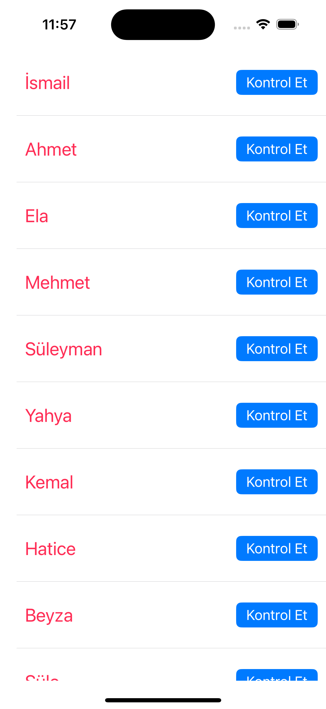
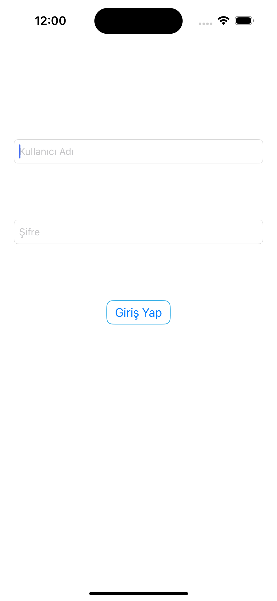
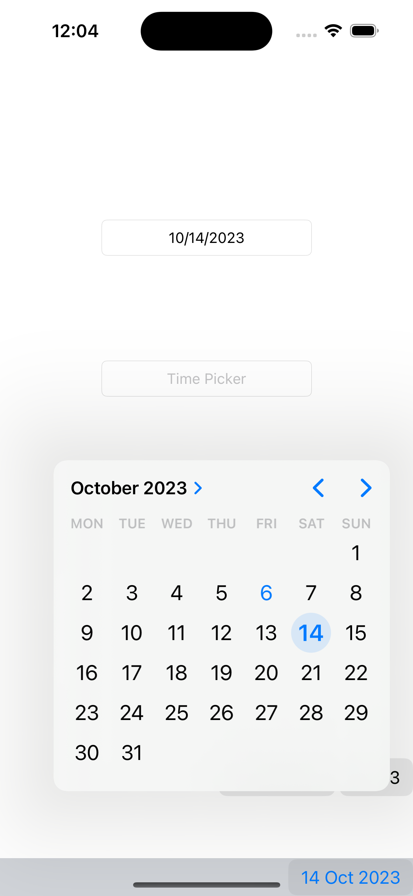
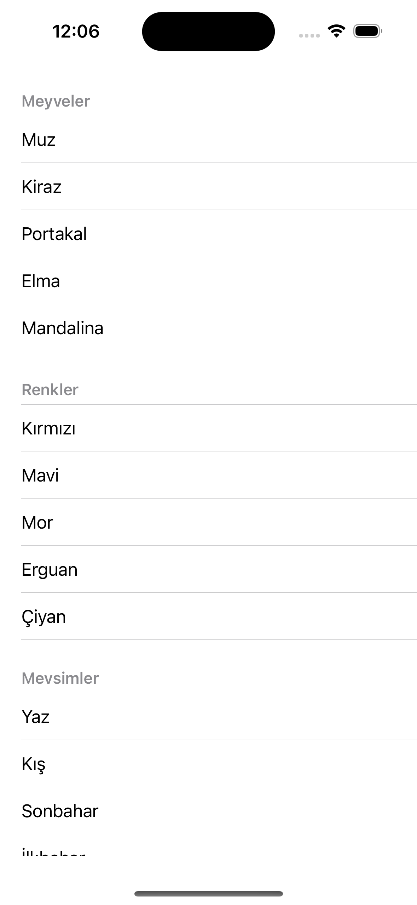
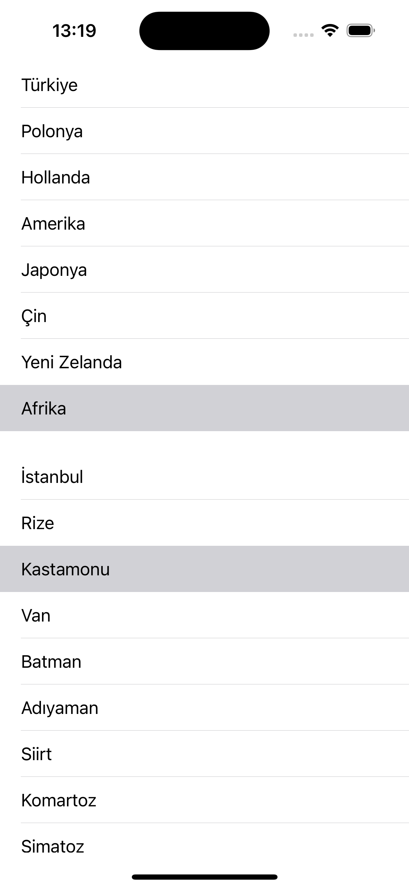
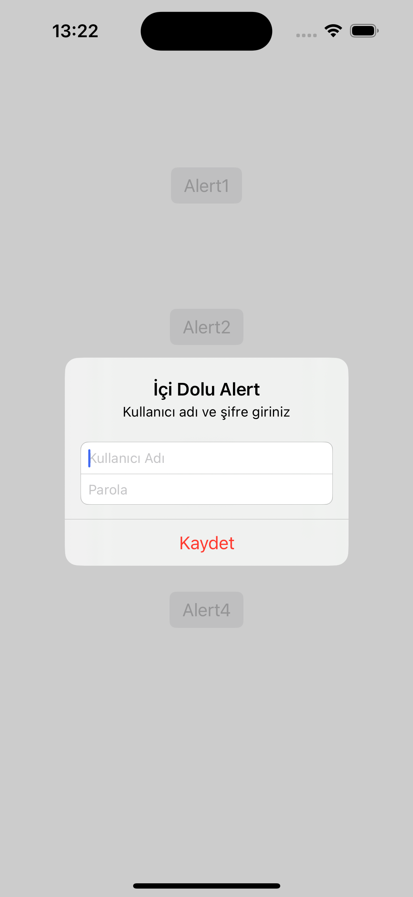

# Udemy-Alistirmalari-Kasim-ADALAN-iOS-Mobil-Uygulama-Gelistirme_Egitimi

# iOS  Alıştırmalar 💻

- IOS developer olma sürecinde ilk olarak BTK Akademi sitesinde bulunan Atil SAMANCIOGLU-Swift ile IOS Programlama dersleri ile başladım. Devamında Udemy de bulunan Kasım ADALAN hocanın iOS Mobil Uygulama Gelistirme Egitimi ile devam ettim.Atıl hoca ile yaptığım temeli bu eğitimle geliştirerek ilerlemeye çalıştım. Bir çok yeni bilgi ile kendimi geliştirerek Kasım hocanın eğitiminide bitirmiş bulunmaktayım. Sonraki aşamada bir çok projelerle mimariler üzerinde ve temiz kod yazma tekniklerinde kendimi geliştirmeyi planlıyorum.  

    
    

Swift, benim için büyük ilgi uyandıran bir programlama dilidir. Özellikle iOS, iPadOS, macOS, tvOS ve watchOS gibi Apple platformlarında kullanılabilmesi büyük bir kolaylık sağlıyor.  Söz dizimi kısa ve anlamlı olduğu için kod yazarken daha az çaba harcamamı sağlıyor.

Swift, geliştiricilere modern programlama dilinin tüm avantajlarını sunuyor. Fonksiyonel ve nesne yönelimli programlama yetenekleri gibi modern özellikleri içeriyor. Bu, geliştiricilerin daha temiz ve düzenli kod yazmalarını kolaylaştırırken, aynı zamanda hızlı ve verimli uygulamalar geliştirmelerine olanak tanır.

En önemlisi, Swift kodu tasarımı gereği güvenli ve güvenilirdir. Dil, tip güvenliği ve güçlü hata denetimi gibi özelliklerle donatılmıştır, bu da programcıların hataları önlemesine ve daha güvenilir yazılımlar oluşturmasına yardımcı olmaktadır. Ayrıca, Swift'in performansı da etkileyici. Hızlı çalışma zamanı beni cezbeden bir diğer alan olmuştur.

Sonuç olarak, Swift programlama dili beni etkileyen güçlü ve sezgisel bir dil. Hem modern özellikleri hem de güvenliği ile geliştiriciler için ideal bir seçenek. Bu nedenle Swift'i öğrenmek ve kullanmak gerçekten heyecan verici bir deneyim olabilir.

## Projenin Amacı ⁉️

Swift ile ilgili temel konuları not alarak ve örneklerle bu işlemi pekiştirmek adına yaptığım bir çalışmadır. Öğrendiklerimi farklı projeler geliştirmek amacıyla oluşturulmuş bir projeler bütünüdür.

## Proje İçeriği 🎁

Swift e  BTK Akademiden Atıl SAMANCIOGLU Hocanın Swift ile IOS Programlama dersleri ile başlangıç yaptım. Kendimi bu alanda dahada ileriye götürmek için Udemy den Kasım ADALAN hocanın iOS Mobil Uygulama Gelistirme Egitimi ile devam ettim. Atıl Hoca ile oluşturduğum temeller üzerine Kasım Hoca ile pekiştirerek ve üzerine kendimi dahada fazla geliştirerek ilerledim. Kasım hoca ile temel olarak aşağıdaki listede belirttiğim konular üzerine not alarak ve egzersizler yaparak bu ortaya koyduğum alıştırmalar bütünüyle bu projeyi oluşturdum.

- Images
- Segues
- GestureRecogziner
- Alert
- Table View
- Core Data
- Tab Bars
- Navigation Bar
- Toolbar
- Klavyeyi Kontrol Etme
- ViewController
- Table View Search
- Collection View
- ViewController Lifecycle
- NotificationCenter
- Alert View
- Picker View
- Date Picker
- Web View
- Custom Keyboard
- SQLite
- Alamofire
- Firebase
- URLSession

